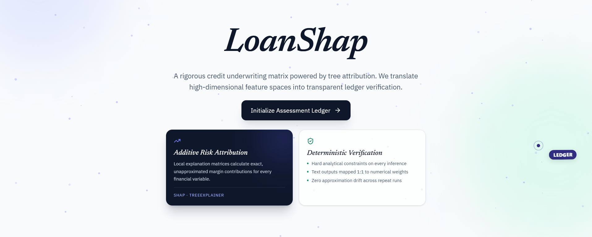

**Explainable AI Loan Approval System**

LoanShap predicts loan approval decisions and explains exactly why - using real, verifiable evidence instead of a black-box score. Every verdict, every factor, and every follow-up answer traces back to an actual number, never a guess.

---
## Screenshots


---
## How it works

1. **Predict** - an XGBoost classifier trained on 45,000 loan records predicts approve/reject with a probability score.
2. **Explain** - SHAP's TreeExplainer computes exactly which applicant factors pushed the decision, and by how much (not approximated).
3. **Narrate** - a Groq-powered LLM restates the SHAP output in plain language, constrained to cite only the values actually returned by the model.
4. **Interrogate** - an "Ask" chat lets you question any factor in the decision; answers are grounded in the same SHAP data, not invented.
5. **Counterfactuals** - for rejected applicants, a DiCE-inspired engine tests real, verified adjustments (credit score, loan-to-income ratio, credit history, etc.) against the live model and shows which ones would actually flip the verdict to approval and informs when none would.

---

## Tech stack

| Layer | Technology |
|---|---|
| Prediction model | XGBoost (gradient-boosted trees) |
| Attribution | SHAP (TreeExplainer) |
| Narration / chat | Groq LLM |
| Counterfactuals | DiCE-inspired verified nudge search |
| Backend | FastAPI |
| Frontend | React + Vite, Tailwind |

---

## Project structure

```
LoanShap/
└── financial-advisor/
    ├── backend/
    │   ├── agents/          # LLM client + explainer logic
    │   ├── api/             # route handlers: predict, explain, ask, dice
    │   ├── data/             
    │   ├── ml/               # model, schemas, predictor
    │   ├── models/           # trained model artifacts
    │   ├── app.py             # FastAPI app entrypoint
    │   ├── config.py
    │   └── requirements.txt
    └── frontend/
        ├── src/
        │   ├── App.jsx        # main UI - applicant input, decision, chat, counterfactuals
        │   ├── RandomLetterSwap.jsx
        │   ├── UserCursor.jsx
        │   └── Snowfall.jsx
        └── public/
            └── demo.csv       # sample applicants for the dashboard
```

---

## API reference

| Endpoint | Method | Purpose |
|---|---|---|
| `/predict` | POST | Returns verdict, probability, risk level, and top SHAP factors for an applicant |
| `/explain` | POST | Returns a plain-language explanation of a prediction |
| `/ask` | POST | Answers a follow-up question, grounded in a given prediction's context |
| `/api/dice` | POST | Generates verified counterfactual scenarios for a rejected applicant |

---

## Build Locally
### Clone the repository
```bash
git clone https://github.com/abhishek9paul/LoanShap.git
```


### Backend
```bash
cd backend
pip install -r requirements.txt
```
Create a `.env` file in `backend/` with:
```
GROQ_API_KEY=your_key_here
```
Run:
```bash
uvicorn app:app --reload
```
API docs available at `http://127.0.0.1:8000/docs`.

### Frontend
```bash
cd frontend
npm install
npm run dev
```
Set `VITE_API_BASE` in a `.env` file if the backend isn't running on `localhost:8000`.

---

## Dataset

Trained on the [Loan Approval Classification dataset](https://www.kaggle.com/datasets/taweilo/loan-approval-classification-data) (Kaggle) - 45,000 records with applicant demographics, loan details, and credit history.

---

## Why this matters

Most credit-scoring models are black boxes - an applicant or reviewer gets a yes/no with no reasoning. LoanShap closes that gap: every decision is backed by real attribution data, every explanation is grounded in that data, and every "what would it take to get approved" answer is verified against the actual model rather than guessed.
